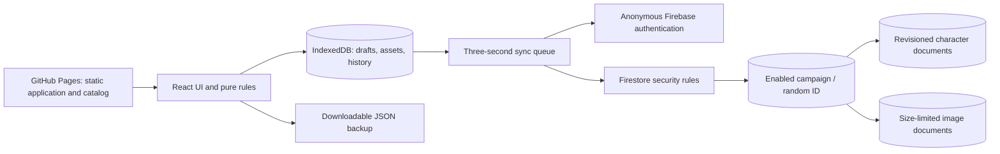

# Architecture and review

DnDev is a static React/TypeScript application built with Vite. GitHub Pages hosts its HTML, CSS, JavaScript, icon, and versioned game catalog. Firebase anonymous authentication and the default Firestore Standard database provide shared campaign persistence. Dexie/IndexedDB holds the durable local outbox, character copies, small images, and recovery checkpoints.

## Components and trust boundaries

There is no application server, server administrator credential, paid identity provider, live Wikidot dependency, or GitHub file-write API. The public Firebase values identify the project, but do not grant database administration. The 256-bit invitation is a capability held by campaign members.

The campaign organizer uses Firebase Console to create/disable campaign documents. Clients can get one known enabled campaign, read its characters, and write revision-checked character/asset documents. They cannot enumerate campaigns, create campaigns, change access flags, or delete campaign data. All invited members have the same access.

Firestore rules validate root fields, core numeric/identity/combat structures, collection types, cardinality limits, revisions, and image envelopes. Firestore rules cannot recursively validate arbitrary dynamic maps of every custom item/feature; Zod applies the complete character contract on import, local edits, and remote reads. A malicious invited participant can still disrupt the shared campaign. This design is deliberately for a **trusted group**, not public multi-tenant hosting. Do not expose the invitation on the public site.

## Save protocol

1. Each edit is validated and committed in an IndexedDB transaction. Major actions create a local checkpoint in the same transaction. Only a successful local commit is considered saved on this device.
2. The first dirty change starts a 3,000 ms timer. Subsequent edits do not move that timer. Unchanged writes are skipped.
3. A remote save transaction reads the latest revision. It compares the last confirmed base, local draft, and current remote character.
4. Independent changes merge recursively by field. Inventory, spells, resources, and selections have stable IDs, so unrelated collection edits can merge. Arrays are atomic: concurrent reorder/history/list edits may need resolution.
5. Overlapping changes remain local and are displayed with both versions. There is no silent last-write-wins overwrite. Resolving all conflicts schedules a fresh revision-checked transaction.
6. A successful acknowledgement updates the base. Edits made while that request was in flight are rebased and remain pending for the next save.
7. Network errors, rejected writes, and quota errors retain the outbox and show a save error. Retries use exponential backoff capped at 60 seconds. Reconnect and manual save trigger another attempt.
8. Page hiding and `pagehide` attempt a flush. Reopening loads pending drafts and retries them. Browsers can terminate a page without completing an asynchronous request, so remote delivery on close is not guaranteed.

The open sheet has a Firestore subscription. The roster is refreshed on entry/return; all campaign sheets are not watched continuously. No Firestore persistent write cache is enabled: IndexedDB's explicit base/draft/conflict queue is the authority for pending operations. Firestore network transactions cannot commit offline. [Firestore transactions](https://firebase.google.com/docs/firestore/manage-data/transactions), [page lifecycle](https://developer.mozilla.org/en-US/docs/Web/API/Document/visibilitychange_event)

## Data and durability

- **Character:** schema version, stable UUID, revision, class tracks/HP rolls, abilities/training, combat values, spells, inventory, coins, resources, selected content snapshots, notes, biography, overrides, and level history.
- **Content entry:** stable ID, category, publication sources, publisher evidence, compatible rules edition, book version, data revision, dependencies, pinned mechanics, and automation label.
- **Local draft:** last confirmed base, current character, local sequence, pending flag, errors, and explicit conflicts.
- **Resource:** current/max values; short, long, both, or manual recovery; full, fixed, or dice recovery amounts.
- **Backup:** versioned character/campaign JSON with pinned selections, custom data, and referenced images. No invitation or authentication credentials.
- **Images:** raster PNG/JPEG/WebP inputs, downscaled to at most 384 pixels and encoded within a 180,000-character envelope. Each is stored separately from the character, uploaded before its reference is synchronized.

Characters are limited to 650 KB, with Firestore's own document limit providing an additional boundary. JSON imports are validated and previewed, then create new IDs. Archive is reversible and does not delete records. Twenty checkpoints per character are retained on that device. Long campaigns need independent exported backups; local browser storage can be evicted or cleared.

The service worker caches application assets and bundled catalog for offline reopening after an initial successful load. Updates use a prompt and never delete IndexedDB. Schema 1 imports gain defaulted optional fields; unsupported schema versions are rejected without changing the original file or current campaign. Future breaking versions must supply explicit, tested migrations and preserve backups.

## Architecture review and decisions

| Alternative or risk                      | Decision                                                                                                               |
| ---------------------------------------- | ---------------------------------------------------------------------------------------------------------------------- |
| Local-only sheets                        | Kept as a demo/offline mode, with Firebase sync for shared campaign continuity.                                        |
| GitHub file writes from browsers         | Rejected: would require dangerous write credentials or a separate backend.                                             |
| Server/functions/object storage          | Omitted to keep setup and billing dependencies small. Tiny portraits fit separate Firestore documents.                 |
| Registered accounts                      | Omitted for the trusted-group invitation flow; anonymous auth still lets rules reject unauthenticated access.          |
| Lost concurrent changes                  | Base/local/remote comparisons, transactions, stable collection IDs, and visible conflict resolution.                   |
| Long typing sessions                     | Fixed dirty-window scheduling, not a debounce restarted on every keystroke.                                            |
| Closing/offline/quota interruption       | Durable local outbox and visible retry state; no promise of guaranteed unload delivery.                                |
| Browser storage loss                     | Campaign exports plus Firestore copies; local recovery history alone is insufficient.                                  |
| Rulebook updates changing old characters | Snapshot selected mechanics; explicitly preview and approve catalog updates.                                           |
| Free-tier exhaustion                     | Spark remains unbilled; synchronization pauses while local work continues. No automatic upgrade.                       |
| Multi-year maintenance                   | No running server to patch. Occasionally review dependencies, source revisions, service terms, and backup restoration. |

At continuous maximum activity, one character could write about 1,200 times/hour. Five players typing continuously for four hours would exceed the free daily write allowance. Ordinary sessions have many idle periods, and only dirty sheets write; still, quota limits are a real operating limit. The requirement is zero billing, not unlimited capacity.

Application rules handle arithmetic and track choices. Narrative effects, combat targeting, eligibility depending on story/campaign state, spell learning limits, complex optional-feature selections, and contextual bonuses require player review. The interface provides source links, configurable effects/resources, and overrides instead of silently inventing adjudications. See [catalog coverage](catalog-coverage.md).

## Immediate organizer actions

Create the two free accounts/resources, publish rules, generate a private campaign, supply public browser config, and enable Pages as described in [deployment](deployment.md). Before relying on the shared campaign, verify a real two-device save/conflict/offline/restore cycle against your own Firebase project.

## Combat reference snapshots

Favorites and optional structured combat references are stored inside existing item/spell records, using stable IDs. Schema version 1 supplies false/null defaults for old imports; no IndexedDB index or Firestore rule change is needed. Computed displays use current ability scores and level plus the record’s pinned formulas. Catalog combat profiles participate in content revisions. Adopting reviewed details is an explicit preview saved by the user. Character-specific edits, spell grants, rests, backup/duplication and independent-field merging retain favorites and overrides. Shared casting/consumption mutations revalidate current resources; editors use three-way comparisons to preserve intervening edits or request a fresh preview for overlaps.
