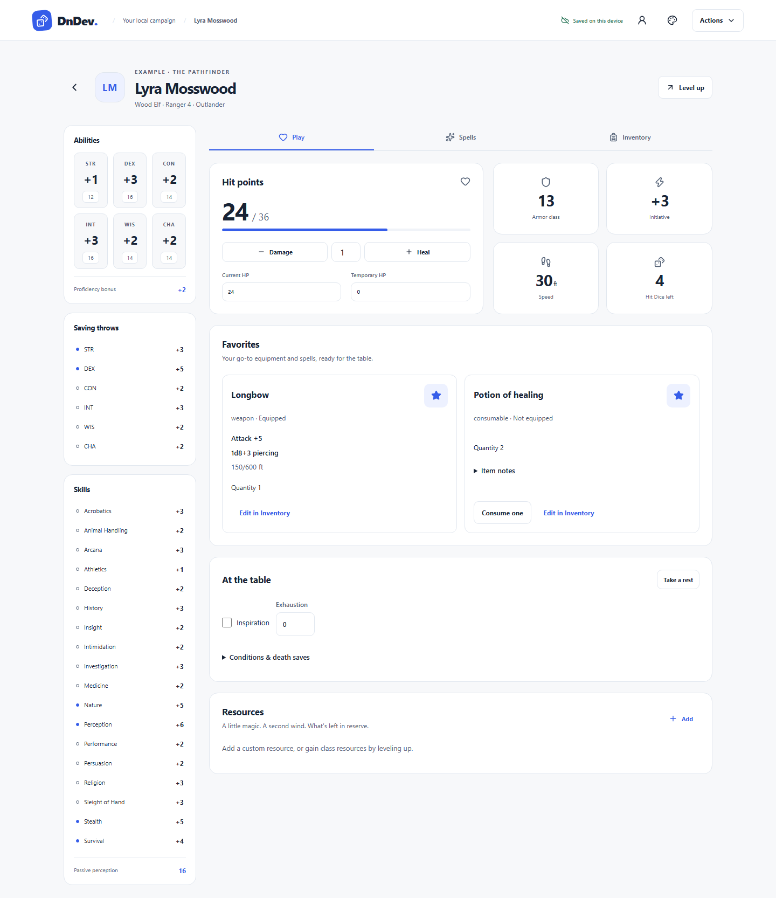
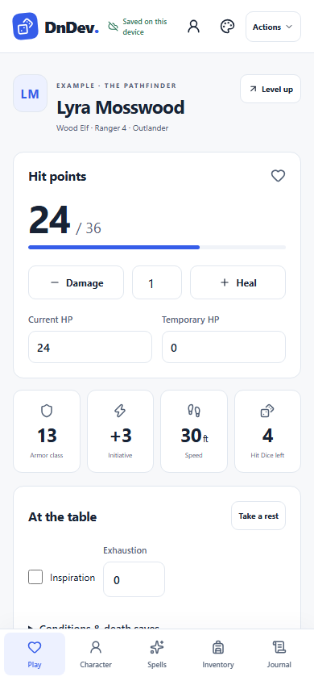

# UX design and review

Desktop: persistent header (campaign, character, save status, menu), identity banner, statistics rail and main section cards. Mobile: the same controls, one content column, and three fixed bottom tabs: Play, Spells, Inventory. Character configuration and preserved notes live under Actions → Advanced settings. Campaign cards show player, class/level, and save information. Save now is the first menu action. No interaction requires hover.

| Journey           | Friction                               | Revision before implementation                                        |
| ----------------- | -------------------------------------- | --------------------------------------------------------------------- |
| Existing level 10 | Replaying ten levels is slow           | Direct class/level entry and editable values                          |
| Level 1 to 4      | Gains disappear in a long sheet        | Preview named gains, HP, slots, and outstanding choices               |
| Multiclass        | Prerequisite errors block house rules  | Explain requirements, record overrides, distinguish total/class level |
| Inventory         | Consumables disappear after use        | Retain zero quantity, separate charges from quantity                  |
| Custom resource   | Reset rules are hidden                 | Explicit trigger, full/fixed/dice amount, preview                     |
| Rest              | Automatic reset loses exceptions       | Editable before/after confirmation and recovery history               |
| Published sources | Names obscure different versions       | Book/version badges, pinned selections, explicit upgrades             |
| Interrupted save  | Local and remote status look identical | Persistent distinct statuses and a durable conflict resolver          |

Modern, Subtle Fantasy, and Strong Fantasy each have light/dark palettes. Theme variables change colors and accents without changing geometry, field order, typography size, or interactions. Modern follows the device scheme initially. All controls need accessible labels, visible focus, and touch-friendly targets. Dialogs manage focus and Escape. Test every story at 390px and desktop widths without horizontal scrolling.

## Wireframes

Desktop keeps the campaign controls visible above a sheet with a supporting statistics column:

```text
┌ DnDev / campaign / character ───── save status · switch · theme · Actions ┐
│ Character identity                                      Level up · Rest │
├─────────────────┬───────────────────────────────────────────────────────┤
│ Ability scores  │ Play             Spells             Inventory          │
│ Saves & skills  ├───────────────────────────────────────────────────────┤
│ Passive checks  │ Hit points / damage / healing       AC / initiative    │
│ Proficiency     │ Favorite items & spells: references, Cast / Use        │
│                 │ Conditions, death saves, rest resources                │
└─────────────────┴───────────────────────────────────────────────────────┘
```

Mobile keeps one content column, persistent header controls, and bottom navigation. Supporting statistics appear below the play controls.

```text
┌ DnDev · save · switch · theme · Actions ┐
│ Character name · class / level         │
│ Level up               Take a rest     │
│                                       │
│ Hit points · damage / healing          │
│ AC · initiative · speed                │
│ Favorite items & spells · Cast / Use   │
│ Resources and conditions               │
│ Supporting statistics                 │
├───────────────────────────────────────┤
│ Play          Spells        Inventory │
└───────────────────────────────────────┘
```

## Implemented views





## Changes from browser review

- Added a persistent character switch button and per-character roster save information. Switching characters or sections resets scroll position so the primary controls are visible.
- Buffered field input while IndexedDB acknowledges edits, so fast typing cannot be overwritten by an older acknowledgement.
- Used explicit input labels and returned keyboard focus to the opening control after closing a dialog.
- Restricted portrait dimensions, and kept all six theme layouts within the phone viewport.
- Removed duplicate subclass feature gains and inactive subclass effects when changing a selection.
- Preserved Artificer spell lists when consolidating identical reprints. Guided spell choices use each class's progression and include Pact Magic.
- Added previewed content revisions and independent casting controls for spells granted by different features.

The browser suite exercises creation, leveling, direct level entry, multiclass overrides, inventory, custom classes/resources, rests, published selections, images, backups, archive recovery, offline reopening, six themes, and keyboard/contrast checks at both screen sizes.

## Table-play update

The primary sections are **Play**, **Spells**, and **Inventory**. **Actions → Advanced settings** opens abilities, class tracks, published selections, customization, artwork, and collapsed biography/journal/legacy action notes. Save now remains the first menu action. Old Character URLs still open Advanced settings; old Journal URLs redirect to its expanded notes section.

Play shows HP/combat statistics, **Favorites**, then conditions and resources. Star an item or spell in its own tab to add a card; unstar it from either location. Items appear first and spells second, alphabetically. Desktop uses two card columns and mobile one. Favorites do not equip items or prepare spells. Depleted entries stay visible.

Cards read current character records. Weapons show damage formulas, optional attack bonuses, quantity/charges, equipment status and range. Spell cards show each copy’s origin/casting ability, casting time/range, concentration/ritual indicators, and available attack, save and damage/healing references. Cast uses the same resource picker in Spells and Play, including Pact slots, free uses, rituals and custom resource costs. Consumables/scrolls and charged items have guarded use buttons; weapon cards do not automatically consume ammunition.

### Rules and editing boundaries

- Ability, saving-throw and skill modifiers are static references. Roll d20s at the table. Non-d20 Hit Dice and recovery rolls remain available in rest previews; d20 recovery asks for a manual adjustment.
- Reviewed SRD weapon properties select STR for melee/thrown melee, DEX for ranged, or the better of STR/DEX for finesse. Versatile damage appears separately. Override the damage ability or extra bonus for specific features; attack bonus text remains editable.
- Spell DC is 8 + proficiency + that spell’s casting modifier; attack bonus is proficiency + that modifier. Target saving-throw ability is a separate field. Cantrips scale by total character level; supported spell formulas scale in the selected-slot preview.
- Per-beam/ray/dart references distinguish individual damage and instance count. The application does not determine hits, targets, situational damage, or every secondary effect. Expand the source details when resolving these effects.
- Existing custom weapon damage text takes priority over calculated damage. Select the appropriate SRD equipment template for an older item, then clear its Damage / type text to enable the calculation. Review before saving.
- Existing spell records keep their snapshots. Open a spell and select **Use catalog combat details** to preview the exact selected entry’s available metadata, then **Save spell**. A new catalog revision does not silently replace a saved reference.
- Expanded-source and custom spells without structured metadata can use **Add combat details**. Enter a save, attack, damage/healing formula, or effect notes. Use the literal MOD token only when an effect adds the casting modifier. No formula evaluates code or simulates damage.

### Critique and streamlining

Three primary destinations reduce navigation during play. Moving configuration into a full page avoids a crowded settings dialog. Keeping biography and old action notes prevents data loss while freeing Play for selected references. Sharing casting and item-use handlers avoids inconsistent resource accounting. Optional structured details and explicit adoption avoid guessing mechanics from names or overwriting table-specific exceptions.

Stars have keyboard-accessible toggles with pressed states. Static statistics have no button/hover affordance. Resource actions disable when depleted, recheck current values before applying, and retain unavailable cards. Cards wrap long names and source references in all six themes.
